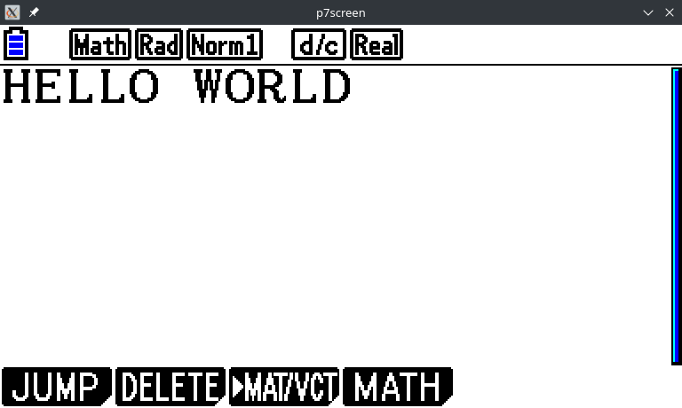

.. _guide-cli-display-screen:

Displaying the screen from a calculator
=======================================

.. warning::

    This guide only works for calculators connected by USB. If you are using
    a serial link, no option is available to you with Cahute yet!

In order to display the screen from a CASIO calculator, the steps are the
following:

1. Connect the calculator to the PC using a USB cable.
2. Select a screenstreaming mode on the USB calculator.
3. Run ``p7screen``.

Once the calculator is connected, a prompt with various protocols is displayed:

* On fx9860G and compatible (monochrome calculators), select
  ``Projector`` (F3).
* On fx-CG and compatible (color calculators), select
  ``ScreenR(XP)`` (F3) or, if it not available, any mode between
  ``Projector`` (F4) or ``ScreenRecv`` (F2).

Once this is done, in a terminal, run the following command::

    p7screen

    p7screen displaying the screen from a Graph 90+E in ``ScreenR(XP)`` mode.

For more options, see :ref:`p7screen`.
