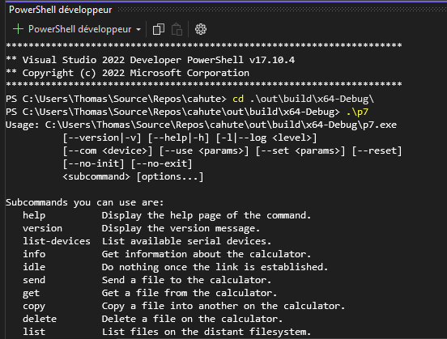

.. _guide-build:

Building Cahute from source
===========================

It is recommended to install Cahute using one of the methods in
:ref:`guide-install`. However, if Cahute is not available for your system,
or if you wish to build it manually, this guide is for you.

Cahute depends on the following build-only dependencies:

* cmake_ >= 3.16;
* Python_ >= 3.8;
* `toml module for Python <python-toml_>`_, either installed through pip
  or as a native package such as ``python-toml`` or ``python3-toml``;
* `GNU Make`_, `pkg-config`_, and other C compilation and linking utilities.

It also depends on the following build and runtime dependencies:

* SDL_ >= 2.0 (for ``p7screen``);
* libusb_.

In order to get the current released version of the Cahute source, you have
the following options:

* You can download the latest source package at
  https://ftp.cahuteproject.org/releases\ :

  .. parsed-literal::

      curl -o cahute-|version|.tar.gz https\://ftp.cahuteproject.org/releases/cahute-|version|.tar.gz
      tar xvaf cahute-|version|.tar.gz

* You can clone the repository and checkout the tag corresponding to the
  release:

  .. parsed-literal::

      git clone https\://gitlab.com/cahuteproject/cahute.git cahute-|version|
      (cd cahute-|version| && git checkout -f |version|)

The project is present in the "cahute-|version|" directory.

.. note::

    Since you will not be using a packaged version of Cahute, the project won't
    be automatically updated when updating the rest of the system, which
    means you will need to do it manually, especially if a security update is
    made.

    You can subscribe to releases by creating a Gitlab.com account, and
    following the steps in `Get notified when a release is created`_.
    You can check your notification settings at any time in Notifications_.

|linux| Linux distributions
---------------------------

In order to install the dependencies, it is recommended you use your native
package manager. A few examples are the following:

* On Debian and derivatives:

  .. code-block:: bash

      sudo apt-get update
      sudo apt-get install cmake python3 python3-toml libusb-1.0-0-dev libsdl2-dev

* On Archlinux and derivatives:

  .. code-block:: bash

      sudo pacman -Sy cmake python python-toml libusb sdl2

* On Voidlinux and derivatives:

  .. code-block:: bash

      xbps-install cmake python3 python3-toml libusb-devel sdl2-devel

In the parent directory to the source, you can now create the ``build``
directory aside it, and install from it, by running the following commands:

.. parsed-literal::

    cmake -B build -S cahute-|version| -DCMAKE_INSTALL_PREFIX=/usr -DCMAKE_BUILD_TYPE=Release
    cmake --build build

.. note::

    If you want to install Cahute on your system directly, you can use the
    following command:

    .. code-block:: text

        sudo cmake --install build --strip

    If, however, you want to install the result into a given directory,
    you can use the following command:

    .. code-block:: text

        DESTDIR=./dist cmake --install build --strip

.. warning::

    For communicating with calculators over USB and serial, Cahute library
    and command-line utilities require access to such devices.

    For serial devices, this is traditionally represented by being a member
    of the ``uucp`` group, defined as the group owner on ``/dev/ttyS*``
    devices; you can check this by running ``ls -l /dev/ttyS*``.
    However, by default, USB devices don't have such rules.

    CMake automatically installs the udev rules, which means you need to
    do the following:

    * Reload the udev daemon reload to apply the newly installed rules
      on the running system without a reboot, with this command **as root**::

          udevadm control --reload

    * Adding your user to the ``uucp`` group, then restarting your session::

          usermod -a -G uucp <your-username>

|mingw-w64| Windows XP and above, from Linux distributions
----------------------------------------------------------

Building Cahute for Windows XP and above from Linux distributions
using `MinGW-w64`_ is possible, as described in `Cross Compiling With CMake`_.
The instructions depend on the Linux distribution you are building from;
these exact instructions are for Archlinux_.

You need to first install the required dependencies from the AUR, by using
your favourite AUR helper, e.g. with paru_::

    paru -S python python-toml mingw-w64 \
        mingw-w64-cmake mingw-w64-libusb mingw-w64-sdl2

In the parent directory to the source, you can now create the ``build``
directory aside it, by running either one of the following command depending
on the architecture you're targetting:

.. parsed-literal::

    i686-w64-mingw32-cmake -B build -S cahute-|version|
    x86_64-w64-mingw32-cmake -B build -S cahute-|version|

You can now build the project using the following command::

    cmake --build build

Before testing with either Wine or a Windows host, it is recommended to
copy the required shared libraries to the build directory, by running either
one of the following command depending on the architecture you're targetting::

    cp /usr/i686-w64-mingw32/bin/{libssp-0,SDL2,libusb-1.0}.dll .
    cp /usr/x86_64-w64-mingw32/bin/{libssp-0,SDL2,libusb-1.0}.dll .

.. warning::

    In order for Cahute to be usable on Windows XP, you need to use a previous
    release of libusb as system requirements have been upgraded.

    `libusb 1.0.23`_ has been proven to work in such cases. The DLLs can be
    found in the ``libusb-1.0.23.7z`` archive, more specifically in the
    ``MinGW32/dll`` and ``MinGW64/dll`` directories.

.. note::

    For reference, this build method is used in the
    `MinGW build image for Cahute`_, which is exploited in the project's
    continuous integration pipelines as described in ``.gitlab-ci.yml``.

|win| Windows XP and above, using Visual Studio
-----------------------------------------------

It is possible to build Cahute for Windows XP and above, using Microsoft's
`Visual Studio`_ starting from version 17.6 (VS2022).

.. warning::

    Visual Studio is **not to be confused** with `Visual Studio Code`_, which
    is an entirely different program.

.. note::

    This version of Visual Studio is targeted since it is the first to
    include ``vcpkg`` (`source <vcpkg is Now Included with Visual Studio_>`_).
    It may be possible to compile Cahute on earlier versions of Visual
    Studio; see `Install and use packages with CMake`_ for more information.

When opening Visual Studio, select "Clone a repository" (first option).

    Initial window for Visual Studio, with the first option selected.

Enter the URL of the repository you're cloning
(``https://gitlab.com/cahuteproject/cahute.git`` if cloning the upstream),
and select "Clone".

    Repository cloning window, with the information filled out to clone
    the main branch on the official project repository.

.. note::

    The IDE may open to nothing much, such as in this example:

    .. figure:: msvs3.png

        Empty IDE windows, obtained after cloning the repository.

    In this case, double-clicking on "Directory view" in the Solution Explorer
    on the right should solve this.

Once the repository is loaded, the IDE should automatically prepare the
repository for building using CMake and vcpkg. The resulting view should
resemble this:

    Visual Studio, after the repository was successfully loaded and configured.

From here, you can select the target you want to build next to the green arrow
on the top, and the architecture you're targetting. By leaving the default
(``x64-Debug``) and clicking on ``p7.exe``, we obtain the following:

    Visual Studio, after building and running p7.

Since Cahute defines mostly command-line utilities, it may be more interesting
to have access to a command-line interface. In order to this, in the context
menu, select "Tools", "Command line", then "Developer Powershell":

    Visual Studio, with contextual menus opened up to "Developer Powershell".

A console should open at the bottom of the IDE. In this console, use ``cd``
to go to the build directory (by default, ``.\out\build\<target>``), and
run the command-line utilities from here with the options you want to test.

    A PowerShell developer console opened in Visual Studio, running p7 from
    the build directory directly.

.. _Get notified when a release is created:
    https://docs.gitlab.com/ee/user/project/releases/
    #get-notified-when-a-release-is-created
.. _Notifications: https://gitlab.com/-/profile/notifications

.. _cmake: https://cmake.org/
.. _Python: https://www.python.org/
.. _python-toml: https://pypi.org/project/toml/
.. _GNU Make: https://www.gnu.org/software/make/
.. _pkg-config: https://git.sr.ht/~kaniini/pkgconf
.. _SDL: https://www.libsdl.org/
.. _libusb: https://libusb.info/

.. _MinGW-w64: https://www.mingw-w64.org/
.. _Archlinux: https://archlinux.org/
.. _paru: https://github.com/Morganamilo/paru
.. _libusb 1.0.23: https://github.com/libusb/libusb/releases/tag/v1.0.23
.. _Cross Compiling With CMake:
    https://cmake.org/cmake/help/book/mastering-cmake/chapter/
    Cross%20Compiling%20With%20CMake.html?highlight=mingw
.. _MinGW build image for Cahute:
    https://gitlab.com/cahuteproject/docker-images/-/blob/develop/mingw-w64/
    archlinux.Dockerfile?ref_type=heads

.. _Visual Studio: https://visualstudio.microsoft.com/fr/
.. _Visual Studio Code: https://visualstudio.microsoft.com/fr/
.. _vcpkg is Now Included with Visual Studio:
    https://devblogs.microsoft.com/cppblog/
    vcpkg-is-now-included-with-visual-studio/
.. _Install and use packages with CMake:
    https://learn.microsoft.com/en-us/vcpkg/get_started/get-started

.. |linux| image:: linux.svg

.. |win| image:: win.png
