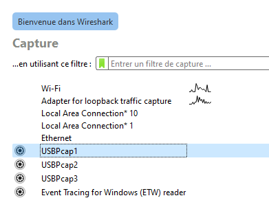
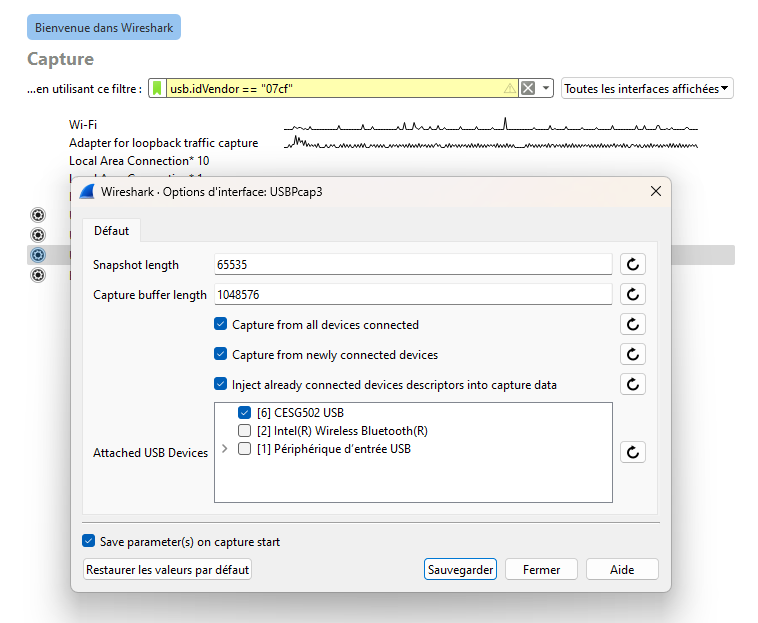
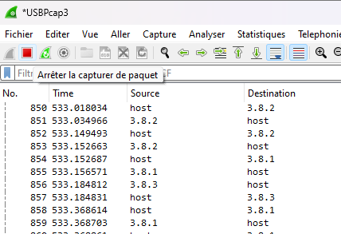
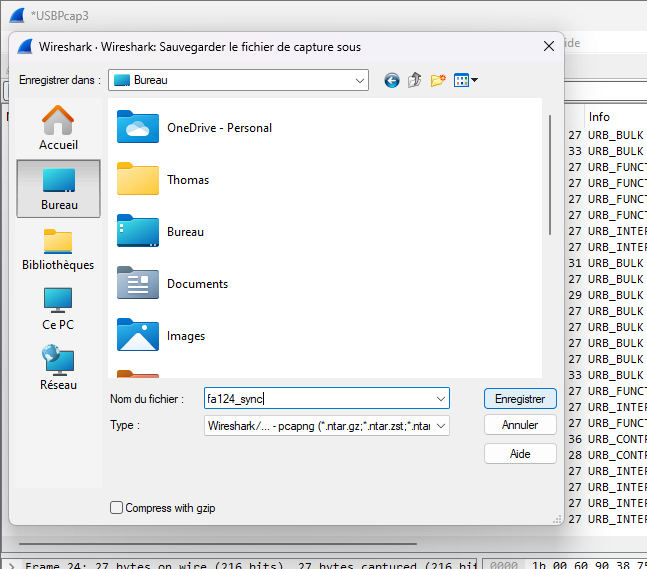
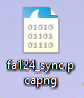

.. _issue-reporting-guide:

Reporting a bug or vulnerability
================================

If you have identified that Cahute or any of its utilities does not work
properly, this guide is here to help you identify the steps in reporting
the issue properly for it to be fixed, or in some cases, at least publicly
documented.

Writing a bug or vulnerability report
-------------------------------------

The report MUST include the following information:

* System and system version on which the issue occurs; e.g. Debian 14,
  Ubuntu 22.04 LTS, Windows 11 Pro, ...
* Hardware architecture on which the issue occurs; e.g. x64, ARM, ...
* Cahute version (e.g. 0.1, 1.2, ...).

If the issue regards a communication protocol, the following information
must also be included:

* The calculator model and OS version, e.g. Graph 90+E with OS 03.60.2202.
* The cable type, brand and/or model, e.g.:

  * E119932-U USB cable (already implicated in at least
    `#31 <https://gitlab.com/cahuteproject/cahute/-/issues/31>`_);
  * `Util-Pocket USB serial cable`_;
  * SB-88 or SB-88(A) USB serial cable;
  * ...

* Whether you have tested with other calculators of the same kind or not.
* Whether you have tested with other cables of the same kind but not the same
  brand, e.g. third-party USB cables.

.. note::

    In order to identify a USB cable, you can read the text on the cable
    itself and transcribe it in your report.

Then, you must indicate the steps to reproduce the issue, on both the host
and any device that was implicated in the operation. It is important that
you respect the exact order in which you execute every action, since this
may be the source of the issue.

.. note::

    An example of concrete steps to reproduce an issue would be the following:

    * Graph 35+USB is already connected to the PC over E119932-U USB cable.
    * Go to LINK, select "Capt" (F6), then "Projector" (F3).
    * Run ``p7screen -l info``.
    * Command emits the following logs, then exits:

    .. code-block:: text

        [2024-08-08 21:09:26 cahute warning] open_simple_usb_link: Calculator not found, retrying in 1 second.
        [2024-08-08 21:09:27 cahute warning] open_simple_usb_link: Calculator not found, retrying in 1 second.
        [2024-08-08 21:09:28 cahute warning] open_simple_usb_link: Calculator not found, retrying in 1 second.
        [2024-08-08 21:09:29 cahute warning] open_simple_usb_link: Calculator not found, retrying in 1 second.
        Could not connect to the calculator.
        - Is it plugged in and in PROJ mode?
        - Have you tried unplugging, plugging and selecting Projector on pop-up?
        - Have you tried changing the cable?

    In this precise example, it is a mistake by the user: the Projector mode
    must be selected when the USB cable is plugged in, and not at a later
    stage.

.. warning::

    If the issue involves a command-line utility, it is recommended to enable
    maximum verbosity, e.g. using ``p7 -l info ...``, ``p7screen -l info ...``,
    ``CaS ... -d``, and so on, and to include the raw output including the
    logs.

A template in markdown for writing a bug report is the following:

.. code-block:: markdown

    - System and version:
    - Architecture:
    - Cahute version:
    - Calculator and version *(if applicable)*:
    - Communication cable *(if applicable)*:

    Steps to reproduce the issue (with maximum verbosity options added to the
    command, such as ``--log info``):

    - ...

Sending your bug or vulnerability report
----------------------------------------

If your issue has security implications, e.g. if it allows a malicious
device to access the host and/or execute arbitrary code without authorisation,
please send an e-mail to Thomas Touhey, the maintainer of Cahute,
at <security@cahuteproject.org>.

.. note::

    Please only use this e-mail address if there is security implications
    to your demand. If you are not sure if your issue qualifies or not,
    send it anyway; use your best judgment.

For all other issues, you can create an issue on the `issue tracker at
Gitlab`_.

.. warning::

    Once your issue is up or sent, **please check on it every few days at
    least, or leave a way for the maintainers to contact you without
    giving up their privacy** (i.e. no phone numbers, social network
    profile or instant messaging address); an e-mail address is fine.

    An issue reported by someone who can't answer once additional details
    are required from them is an issue that gets closed and has wasted
    everyone's time and efforts.

.. warning::

    For any type of issue, due to the fact that Cahute is free software
    maintained by people on their free time, there is no guarantee of any
    delay, or even of a response or that the issue won't be closed due to
    lack of availability on the maintainers' part.

    Note however that this warning is worst case scenario, and hopefully,
    it won't come to that for any correctly reported issue.

.. _usb-capture-guide:

Capturing USB communications using Wireshark
--------------------------------------------

.. warning::

    This method requires a lot of tinkering, and is reserved for advanced
    users. If you do not feel comfortable with this guide, feel free to
    refuse or abandon at any point!

.. note::

    To bring more context, and if you feel yourself to be up to it, it is also
    possible to record your screen at the same time the capture is going on.

Sometimes, when dealing with exotic calculator models or cables, if you have
access to a Microsoft Windows machine, a maintainer may ask you to capture
communications from other software for analysis.

First, ensure that you have all of the official CESG502 driver from CASIO
by installing `FA-124`_, and rebooting your computer.

Then, you must download and install Wireshark_, and ensure that it comes
with **USBPCap**; see `Wireshark USB capture setup for Windows`_ for
more information.

You can now run Wireshark, and will see one ``USBPcap`` interface per USB
bus. You will need to determine on which will the calculator is present, and
filter on it to avoid including communication from other devices (which would
be a privacy breach for you!).

In order to accomplish this, you must first connect your calculator and place
it in Receive or USB Key mode, so that it is detected by the computer.

    Preview of the interface list, with the gear icon next to the ``USBPcap``
    interfaces.

Then, you can select the small gear icon next to every interface, until you
see one with "CESG502 USB".

    Options for one of the ``USBPcap`` interfaces, with the ``CESG502 USB``
    device appearing and checked.

You must select it, click on save (on the bottom of the window), then
double click on the interface to select it. You can now disable Receive or
USB Key mode on your calculator.

.. note::

    Wireshark unfortunately does not have an option to discard the first
    packets; you can help the reader distinguish what is part of the actual
    exchange by leaving a large enough interval at this point, e.g. 10 seconds.

From here, Wireshark is recording! You can run your test scenario, and
Wireshark will capture the communications between your computer and calculator.

Once your test is finished and the communication with the calculator is
terminated properly, you can select the button to stop the capture (red
square).

    Wireshark capture interface with the stop icon (red square) highlighted.

Once the capture has stopped, you must save the result by going to
``File > Save As`` in the contextual menu, then choosing a file name.

    Wireshark capture save interface.

The resulting file will have the ``.pcap`` or ``.pcapng`` extension, which you
can transmit to the maintainer **in a private manner**, as the file may contain
identifying information.

    Wireshark capture file preview on the Windows desktop.

.. _Issue tracker at Gitlab: https://gitlab.com/cahuteproject/cahute/-/issues
.. _Util-Pocket USB serial cable:
    https://web.archive.org/web/20160324164019/http://www.util-pocket.biz/
.. _FA-124:
    https://www.planet-casio.com/Fr/logiciels/
    voir_un_logiciel_casio.php?showid=16
.. _Wireshark: https://www.wireshark.org/
.. _Wireshark USB capture setup for Windows:
    https://wiki.wireshark.org/CaptureSetup/USB#windows
