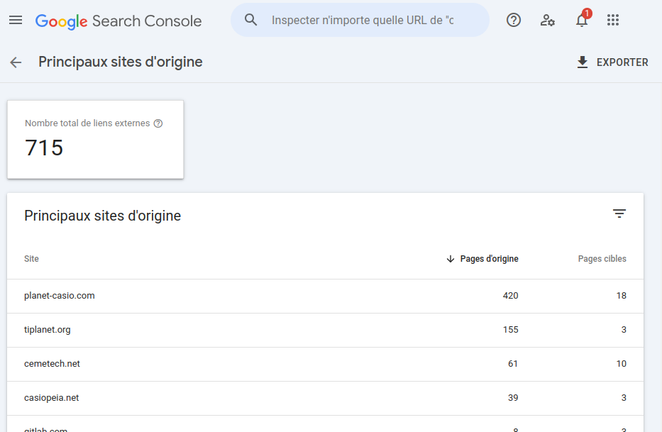
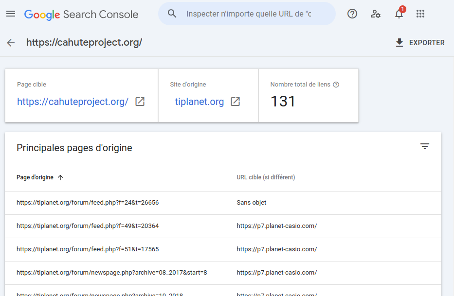

.. _project-feedback:

Community feedback
==================

As most free software projects, Cahute depends on community feedback to
survive and evolve. This page references all of the ways such feedback
is collected.

Maintainers for this repository are expected to be present on all of the
places described here, even if irregularly.

Repository issues
-----------------

The direct way for users to communicate on the project and about bugs and
requested features are `Gitlab issues on the cahuteproject/cahute repository
<Gitlab issues_>`_.

.. _project-forums:

Forums and other communities
----------------------------

Cahute is a product of other communities around calculators, usually
specifically CASIO-oriented ones. As such, it does not have a forum of its own,
and is described in topics on forums of said communities:

* `Planète Casio <Planète Casio topic_>`_ (*in French*);
* `TI-Planet <TI-Planet topic_>`_ (*in French*);
* `Casiopeia <Casiopeia topic_>`_;
* `Universal Casio Forum <UCF topic_>`_;
* `Cemetech <Cemetech topic_>`_.

The main instant messaging place for discussing Cahute, along with many other
projects, is the `#projets shoutbox channel on Planète Casio
<projets channel_>`_, which requires:

* `Creating a Planète Casio account`_;
* Having at least 30 points, which can be obtained by `introducing yourself on
  the dedicated topic`_.

.. note::

    While the forum is presented in French, user members are used to also
    communicating in English with non-French speaking members, including on
    instant messaging platforms; don't feel obliged to speak French to join!

Tracking
--------

The project does not collect any statistics other than through
the `Google Search Console`_, which tracks:

* Which Google search queries have led to the user going to Cahute's website
  and documentation;
* Links to the Cahute websites and documentation found by Googlebot_.

Here is a preview of what the maintainers can see through the
`Google Search Console`_ for Cahute:

    A view of which websites reference the Cahute documentation, by domain.

    A view of which links reference the Cahute documentation on a given
    domain (here, ``tiplanet.org``).

.. _Gitlab issues: https://gitlab.com/cahuteproject/cahute/-/issues
.. _Planète Casio topic:
    https://www.planet-casio.com/Fr/forums/topic17699-1-cahute-pour-
    communiquer-efficacement-avec-sa-calculatrice-casio-sous-linux.html
.. _TI-Planet topic:
    https://tiplanet.org/forum/viewtopic.php?t=26656
.. _Casiopeia topic:
    https://www.casiopeia.net/forum/viewtopic.php?f=19&t=8102
.. _UCF topic:
    https://community.casiocalc.org/topic/
    8214-cahute-a-toolset-for-protocols-and-file-formats/
.. _Cemetech topic:
    https://www.cemetech.net/forum/viewtopic.php?p=307733
.. _projets channel: https://www.planet-casio.com/Fr/shoutbox/projets
.. _Creating a Planète Casio account:
    https://www.planet-casio.com/Fr/compte/creation_nouveau_compte.php
.. _Introducing yourself on the dedicated topic:
    https://www.planet-casio.com/Fr/forums/topic11464-14-presentations.html
.. _Google Search Console: https://search.google.com/search-console/about
.. _Googlebot: https://en.wikipedia.org/wiki/Googlebot
